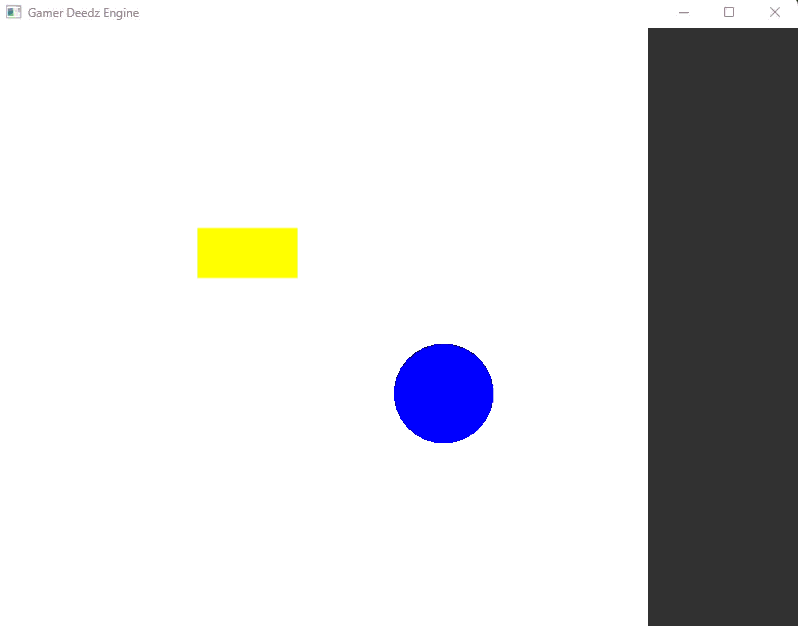

# Gamer Deedz Engine
A custom-built C++ game engine using SFML for rendering and entity-component-system (ECS) architecture.


## Overview
- Entity-Component-System (ECS) architecture
- Input management (keyboard + mouse)
- Basic movement system (in progress)
- Sidebar UI with buttons (in progress)
- Extendable for rendering and physics



## Installation
1. Clone repo:
```bash 
git clone https://github.com/ddierra/Gamer-Deedz-Engine.git
```

2. Build with CMake:
```
mkdir build && cd build
cmake ..
mingw32-make
```

3. Run the engine:
```
./GameEngine.exe
```
> Requires: SFML 2.5, C++17 compiler (e.g., MingGW on Windows), CMake

### How to Use
Use keys WASD to move yellow rectangle and up, left, right, down arrows to move blue circle.

### To-Do
- Coloring System
- Movement System
- Rendering System
- Physics
- Button management


#### Contributing
- Dierra Delaney

#### Licensing
This project is currently not licensed and is a means for personal development.

